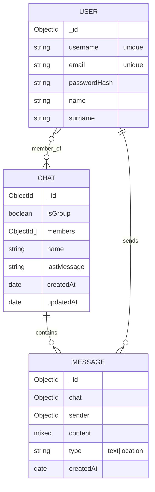

# Mean Chat Backend

Backend service for the Mean Chat app.

Stack:

- Node.js + Express
- MongoDB + Mongoose
- Socket.IO for realtime chat
- JWT authentication

## Features

- User registration and login
- JWT-protected routes
- Refresh token rotation and token revocation on logout
- Create private/group chats
- Fetch chats and paginated message history
- Realtime messaging events via Socket.IO
- Chat list realtime updates (chat-created and chat-updated)

## BBDD Diagram



## Project Structure

- server.js: app entry point (Express, Socket.IO, Mongo connection)
- src/routes:
  - auth.js
  - chat.js
- src/models:
  - User.js
  - Chat.js
  - Message.js
  - RefreshToken.js
- src/socket:
  - index.js
  - chatEvents.js
  - messageEvents.js
  - disconnectEvents.js
  - userEvents.js (currently placeholder)
- src/middleware:
  - auth.js
- src/utils:
  - tokenUtils.js

## Scripts

```bash
npm run dev
npm run start
npm run test
```

## Local Setup

1. Install dependencies:

```bash
npm install
```

2. Create .env in this folder (mean-chat-back/.env):

```env
PORT=3000
MONGO_URI=mongodb://localhost:27017/mean-chat
JWT_SECRET=<your-secret>
JWT_REFRESH_SECRET=<your-refresh-secret>
FRONTEND_URL=http://localhost:4200
```

3. Start development server:

```bash
npm run dev
```

## API Summary

Auth routes:

- POST /auth/register
- POST /auth/login
- POST /auth/refresh
- POST /auth/logout
- GET /auth/me
- GET /auth/users

Chat routes:

- POST /chat
- GET /chat
- GET /chat/:id
- GET /chat/:id/messages?page=1&limit=30

All /chat routes require Bearer token auth.

Authentication notes:

- Access tokens expire in 1 hour.
- Refresh tokens expire in 7 days.
- Refresh tokens are rotated on every /auth/refresh call.
- /auth/logout revokes the current refresh token.

## Socket Events Summary

Incoming events:

- join-chat ({ chatId })
- leave-chat
- chat-message (string or { content, type })

Outgoing events:

- chat-created
- chat-updated
- chat-message
- user-joined
- user-left

## Swagger

- Available at /api-docs only when NODE_ENV is not production.
- In Docker production-mode backend, /api-docs is expected to return 404.

## Docker

- Dockerfile builds production runtime with npm ci --omit=dev.
- In compose, backend receives:
  - MONGO_URI=mongodb://mongo:27017/mean-chat
  - NODE_ENV=production

## Notes

- userEvents.js is currently empty by design and can be used for future presence/user-specific realtime logic.
- Current rate limiting is applied to /auth routes.
